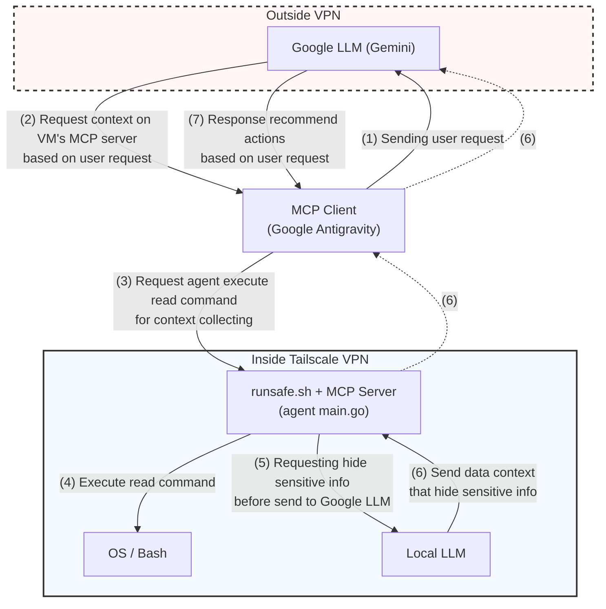
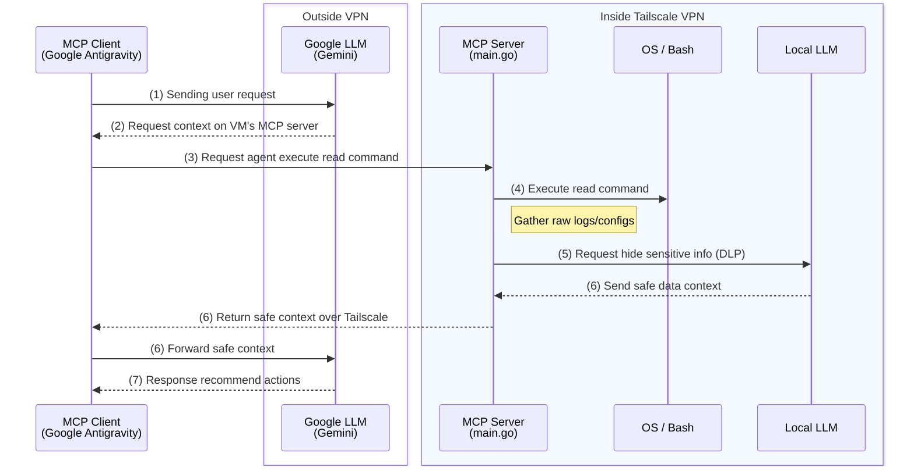

## 🏛️ Architecture

```mermaid
graph TD
    subgraph Outside ["Outside VPN"]
        Gemini["Google LLM (Gemini)"]
    end

    Client["MCP Client<br>(Google Antigravity)"]

    subgraph VPN ["Inside Tailscale VPN"]
        Agent["runsafe.sh + MCP Server<br>(agent main.go)"]
        OS["OS / Bash"]
        LocalLLM["Local LLM"]

        Agent -->|"(4) Execute read command"| OS
        Agent -->|"(5) Requesting hide sensitive info<br>before send to Google LLM"| LocalLLM
        LocalLLM -->|"(6) Send data context<br>that hide sensitive info"| Agent
    end

    %% Luồng giao tiếp bên ngoài và xuyên VPN
    Client -->|"(1) Sending user request"| Gemini
    Gemini -->|"(2) Request context on VM's MCP server<br>based on user request"| Client
    Client -->|"(3) Request agent execute read command<br>for context collecting"| Agent
    
    Agent -.->|"(6)"| Client
    Client -.->|"(6)"| Gemini
    
    Gemini -->|"(7) Response recommend actions<br>based on user request"| Client

    %% Đổ màu nền nhẹ cho dễ phân biệt
    style VPN fill:#f4f8ff,stroke:#333,stroke-width:2px
    style Outside fill:#fff5f5,stroke:#333,stroke-width:2px,stroke-dasharray: 5 5
```

## 🔄 Data Workflow

```mermaid
sequenceDiagram
    participant Client as MCP Client<br>(Google Antigravity)
    
    box Outside VPN
        participant Gemini as Google LLM<br>(Gemini)
    end
    
    box rgb(244, 248, 255) Inside Tailscale VPN
        participant Agent as MCP Server<br>(main.go)
        participant OS as OS / Bash
        participant LocalLLM as Local LLM
    end

    Client->>Gemini: (1) Sending user request
    Gemini-->>Client: (2) Request context on VM's MCP server
    Client->>Agent: (3) Request agent execute read command
    Agent->>OS: (4) Execute read command
    Note right of Agent: Gather raw logs/configs
    Agent->>LocalLLM: (5) Request hide sensitive info (DLP)
    LocalLLM-->>Agent: (6) Send safe data context
    Agent-->>Client: (6) Return safe context over Tailscale
    Client->>Gemini: (6) Forward safe context
    Gemini-->>Client: (7) Response recommend actions
```
