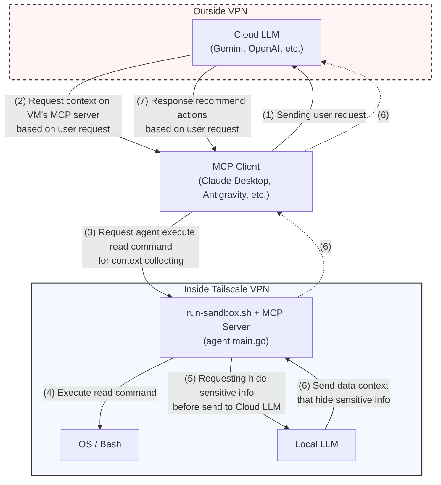
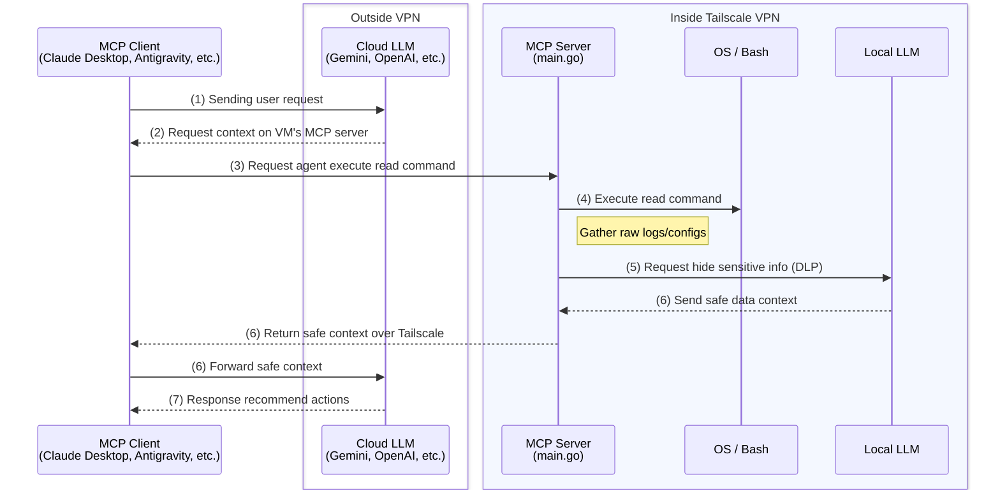
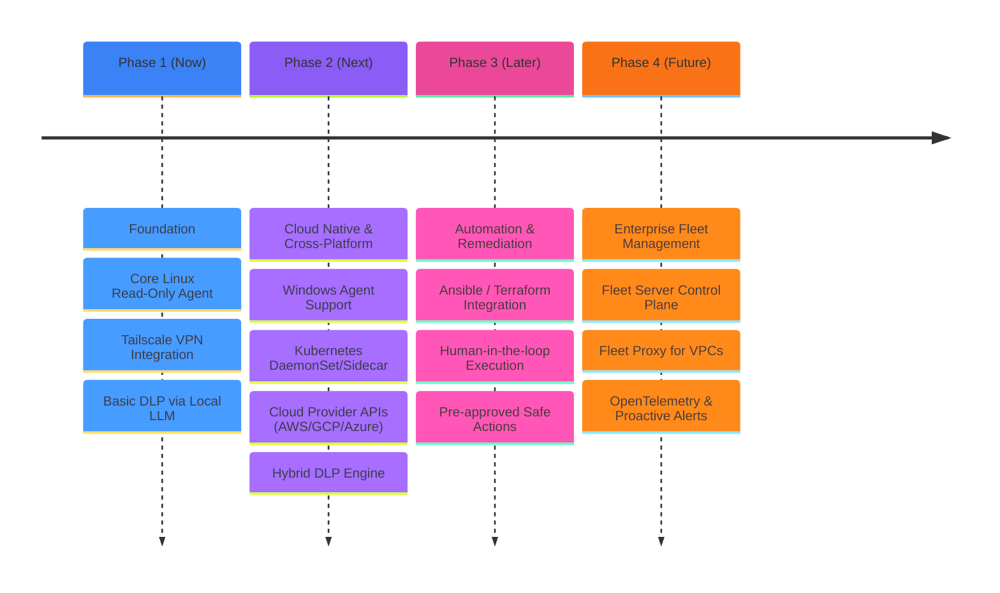

# MCP System Agent

A simple and secure MCP server that allows AI assistants (like Gemini) to read logs and troubleshoot my Linux VMs.

To keep things safe, the agent only runs read-only commands inside a systemd sandbox. Before sending any server logs back to the cloud AI, it uses a local AI model (Ollama) over Tailscale to automatically redact passwords, API keys, and other sensitive data.

## 🏛️ Architecture

## 🔄 Data Workflow

## 🗺️ Roadmap

